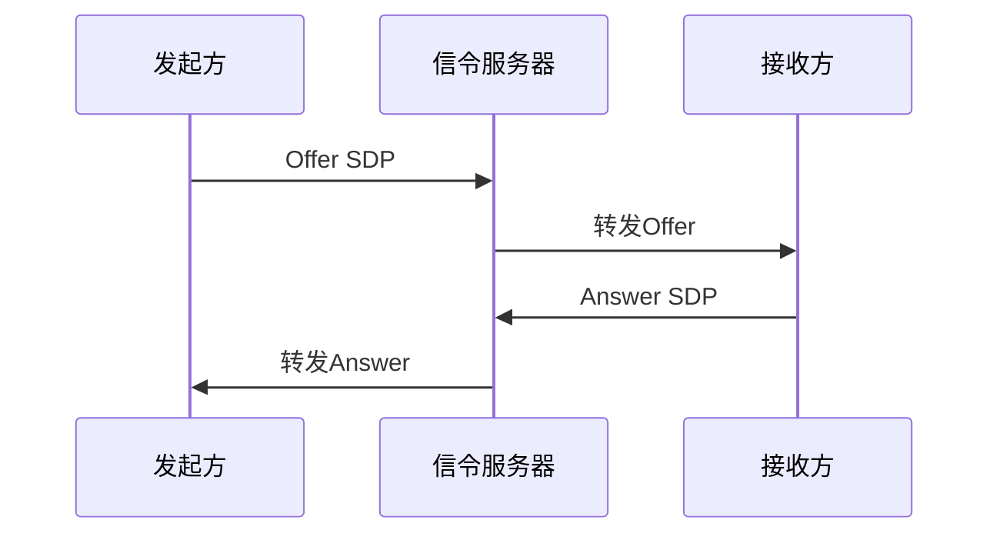
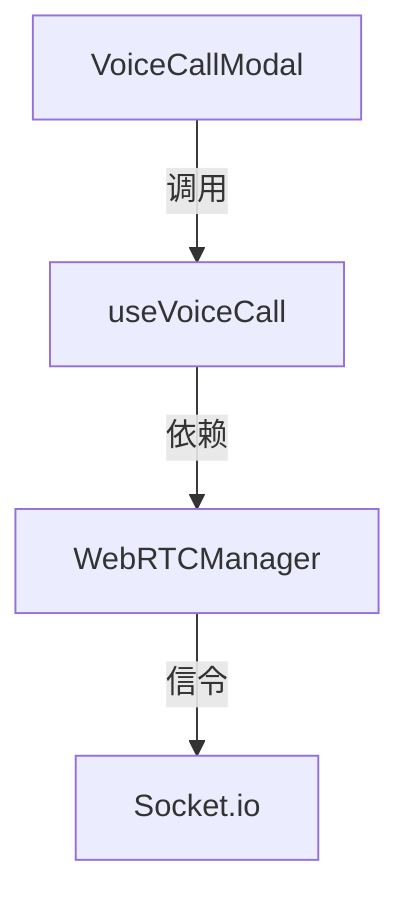

# WebRTC 从入门到精通指南

## 一、WebRTC 基础概念
### 1.1 什么是 WebRTC
WebRTC (Web Real-Time Communication) 是支持浏览器之间进行实时音视频通信的开源项目。核心特点：
- 点对点 (P2P) 通信
- 无需插件
- 加密传输
- 跨平台支持

### 1.2 核心组件
| 组件 | 作用 |
|------|------|
| `RTCPeerConnection` | 管理完整连接生命周期 |
| `RTCDataChannel` | 传输任意数据 |
| `MediaStream` | 处理音视频流 |

## 二、核心 API 详解
### 2.1 RTCPeerConnection
```javascript
const pc = new RTCPeerConnection(configuration);
```
关键事件：
- `onicecandidate` ICE 候选生成
- `ontrack` 远程流到达
- `onnegotiationneeded` 需要重新协商

### 2.2 媒体获取 API
```javascript
// 获取麦克风输入
const stream = await navigator.mediaDevices.getUserMedia({
  audio: true,
  video: true
});
```

## 三、信令服务器原理
### 3.1 信令流程


## 四、NAT 穿透与 ICE
### 4.1 ICE 候选类型
| 类型 | 说明 |
|------|------|
| Host | 本地IP地址 |
| Srflx | STUN服务器反射地址 |
| Relay | TURN服务器中继地址 |

## 五、媒体流处理
### 5.1 轨道控制
```javascript
// 静音本地音频
audioTrack.enabled = false;
// 停止轨道
track.stop();
```

## 六、项目实战分析
### 6.1 本项目架构


### 6.2 关键实现解析
1. **配置优化**：
```javascript
// 使用多个STUN服务器提高连接成功率
iceServers: [
  { urls: 'stun:stun.l.google.com:19302' },
  { urls: 'stun:stun1.l.google.com:19302' }
]
```

2. **状态管理**：
```typescript
// 完整的连接状态监控
onconnectionstatechange = () => {
  if(state === 'failed') this.cleanup();
}
```

3. **错误恢复**：
```typescript
// 自动重置机制
reset() {
  this.cleanup();
  this.initialize();
}
```

## 最佳实践建议
1. 始终处理 ICE 候选超时
2. 实现完整的重连逻辑
3. 添加带宽自适应控制
4. 使用统计API监控质量

## 扩展学习
- [官方规范] W3C WebRTC 1.0
- [调试工具] chrome://webrtc-internals
- [测试工具] test.webrtc.org